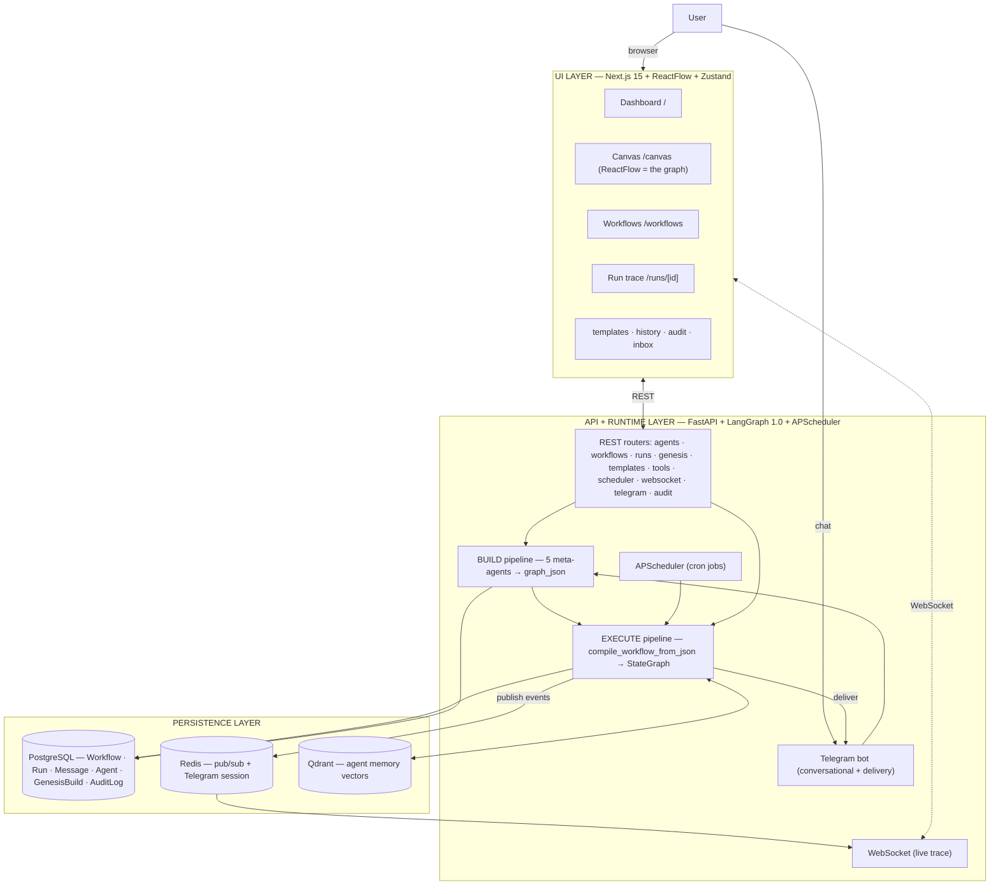
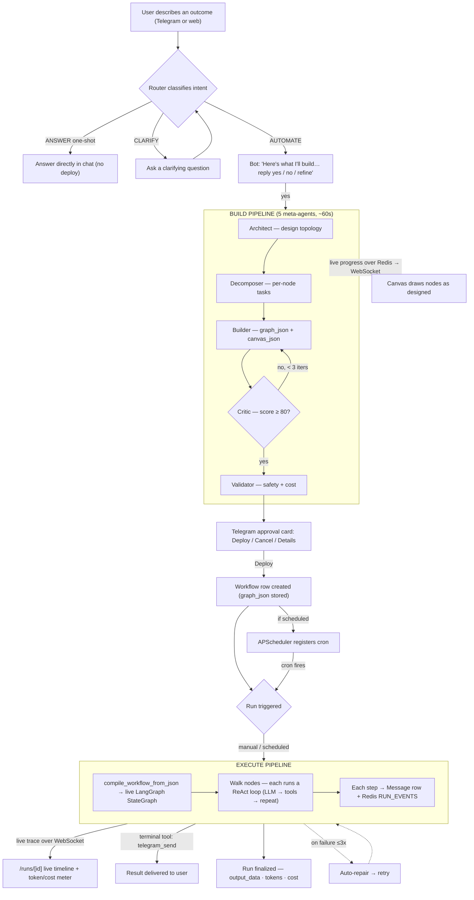
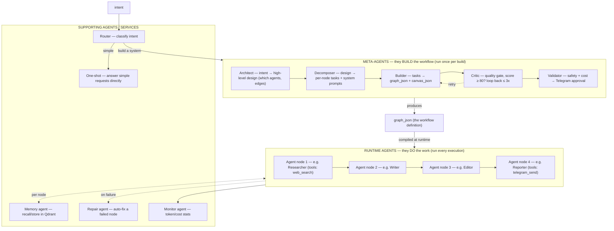

# Genesis — Architecture & Flow Diagrams

*Mermaid source for the system architecture, the end-to-end workflow flow, and the
agent families. Paste any block into a Mermaid renderer (GitHub renders these
natively in Markdown) to view. All three validated as correct Mermaid.*

---

## 1. System Architecture (three layers)

---

## 2. End-to-End Workflow Flow (intent → delivered result)

---

## 3. The Two Families of Agents

> **Each RUNTIME agent node runs a ReAct loop:** call the LLM → if it returns tool
> calls, execute the tools and feed results back → repeat (up to `max_iterations`)
> → write the node's output to `intermediate_results` → pass to the next node.

---

## The agents, explained

Genesis has **two completely different families of agents** — this is the key thing
to understand:

### Family 1 — Meta-agents (the factory). They *build* a workflow.
They run **once**, when you describe an intent. They are hard-coded into Genesis
(`backend/genesis/agents/`):

| Agent | What it does |
|---|---|
| **Architect** | Reads your intent, designs the high-level multi-agent system — which agents exist, their roles, how they connect. |
| **Decomposer** | Turns that design into concrete per-node tasks, system prompts, and input/output schemas. |
| **Builder** | Emits the actual executable `graph_json` (the LangGraph definition) + `canvas_json` (the visual). |
| **Critic** | Quality-gates the result; if score < 80 it sends it back to the Builder (up to 3 times). |
| **Validator** | Safety + cost check, then sends you the Telegram approval card. |

Output: a `graph_json` — the definition of *your* workflow.

### Family 2 — Runtime agents (the product). They *do* the work.
These are the agents *inside* the workflow the meta-agents built. They run **every
time the workflow executes**. They are not hard-coded — they're defined by the
`graph_json` (each node = one agent with its own prompt, model, and tools). Example
for a content pipeline: Researcher → Writer → Editor → Reporter. Each node runs a
ReAct loop and hands its output to the next.

### Supporting agents/services
- **Router** — classifies a new intent (ANSWER / CONVERSE / RETRIEVE / AUTOMATE /
  CLARIFY) before the build pipeline.
- **One-shot** — answers simple requests directly, no workflow.
- **Memory agent** — recalls/stores per-node conclusions in Qdrant.
- **Repair agent** — auto-fixes a node that failed, then retries (≤3×).
- **Monitor agent** — records token/cost stats per run.

---

## Did it actually work? (verified on the live deployment, 2026-06-02)

**Yes — it works.** Checked against the live Railway backend:

- **32 workflows** deployed, all `active`.
- **40 most-recent runs: ALL completed** (zero failed in the recent window).
- **Scheduled runs fired automatically on their crons** (e.g. the 09:00 and 08:00
  jobs ran today without manual triggering) — APScheduler is working.
- **Real output, not stubs:** the HackerNews AI Digest run (2026-06-02) produced a
  genuine digest of *current* stories (Anthropic/OpenAI/SpaceX IPO analysis), with a
  **53-step trace: 22 tool calls, 22 tool results, 5 agent outputs** across multiple
  nodes — real multi-agent execution with real web tool use, persisted end to end.
- **Honest behavior where data is absent:** the Lead Enrichment Bot completed but
  *flagged that it ran on demo data* (no real CRM connected) rather than fabricating
  — correct, trustworthy behavior, not a failure.

So the agent flow someone built **does work** end-to-end: build → deploy → schedule
→ run → deliver, with a real persisted trace and live cost tracking. The known
limitations (in-memory durability, no multi-tenancy, the exec/eval footguns) are
documented in CURRENT_ARCHITECTURE.md and are what the future architecture addresses.
